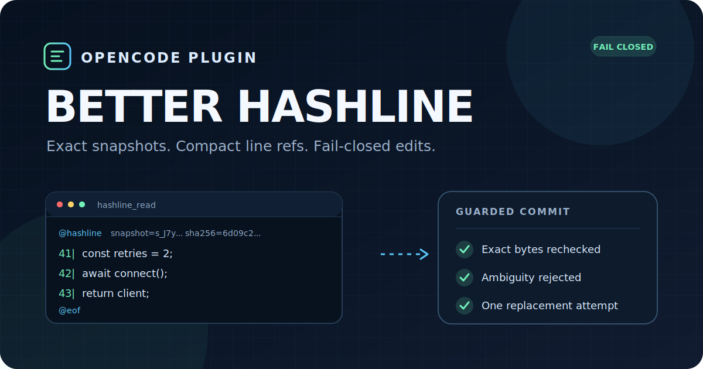
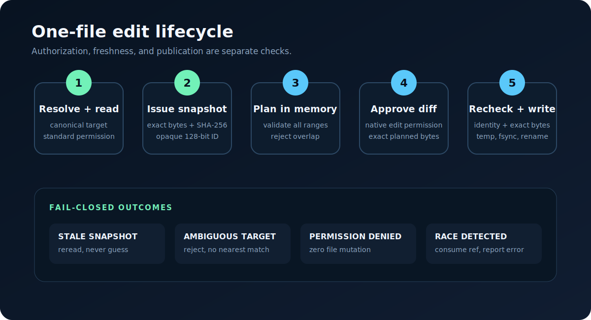

<p align="center">
  
</p>

<h1 align="center">OpenCode Better Hashline</h1>

<p align="center">
  <strong>Точные снимки. Компактные ссылки на строки. Изменения с безопасным отказом.</strong>
</p>

<p align="center">
  Протокол безопасного редактирования для агентов OpenCode, который привязывает каждое изменение к точным данным снимка, действительно прочитанным агентом.
</p>

<p align="center">
  <a href="https://github.com/makcimbx/opencode-better-hashline/actions/workflows/ci.yml"></a>
  <a href="https://www.npmjs.com/package/opencode-better-hashline"></a>
  <a href="LICENSE"></a>
  <a href="SECURITY.md"></a>
</p>

<p align="center">
  <a href="README.md">English</a> ·
  <a href="README.ru.md"><strong>Русский</strong></a>
</p>

<p align="center">
  <a href="#быстрый-старт">Быстрый старт</a> ·
  <a href="#как-это-работает">Как это работает</a> ·
  <a href="#конфигурация">Конфигурация</a> ·
  <a href="#проверяемые-результаты">Результаты</a> ·
  <a href="#документация">Документация</a>
</p>

| Точные данные | Зависимые от операции значения по умолчанию | Разрешения OpenCode | Защищённая публикация |
| :--- | :--- | :--- | :--- |
| Сохранённые байты файла вместо коротких хешей строк | Для инкрементальных операций отсутствие режима означает точный перенос `unique`, а для `replace_file` и lifecycle-операций остаётся строгий режим | Используются существующие разрешения `read`, `edit` и `external_directory` | Один план, повторная проверка и публикация без перезаписи |

> [!IMPORTANT]
> Better Hashline защищает транспорт редактирования, но не является файловой транзакцией или песочницей безопасности. Команды оболочки и враждебные внешние процессы находятся вне его гарантий. Перед использованием в чувствительной среде прочитайте [модель угроз](docs/threat-model.md).

> [!NOTE]
> Это русскоязычный обзор проекта. Нормативными источниками для точных контрактов, кодов ошибок и граничных случаев остаются английские [README](README.md) и [спецификация протокола](docs/protocol.md).

## Быстрый старт

**Требования:** [OpenCode](https://opencode.ai/) `>=1.18.3 <2` и Bun `>=1.3.0`.

```sh
opencode plugin opencode-better-hashline
```

Либо добавьте пакет в `opencode.json`:

```json
{
  "$schema": "https://opencode.ai/config.json",
  "plugin": ["opencode-better-hashline"]
}
```

После изменения конфигурации перезапустите OpenCode. Плагин сразу использует зависящие от операции настройки по умолчанию, обязательных параметров нет.

Убедитесь, что пакет действительно загружен:

```sh
opencode debug agent build --tool hashline_read --params '{"filePath":"README.md","limit":1}'
```

Результат должен начинаться с `@hashline snapshot=`. Если пакет не удалось импортировать, OpenCode может продолжить работу без плагина, а встроенные инструменты изменения файлов останутся доступны. Диагностический fail-closed режим начинается только после загрузки модуля плагина.

## Зачем нужны точные снимки

Во многих инструментах рядом с каждой строкой выводится короткая контрольная сумма, которая затем считается подтверждением актуальности. Better Hashline разделяет адресацию и полномочия:

- модель видит компактные строки вида `N|content`;
- плагин хранит точные байты файла за непрозрачным 128-битным идентификатором снимка;
- перед записью файл перечитывается, после чего применяется строгая проверка байтов либо точный однозначный перенос в зависимости от операции и `rebase`;
- изменённая цель без точного однозначного переноса, неоднозначное или конфликтующее изменение отклоняется до мутации.

| Свойство | Поведение Better Hashline |
| --- | --- |
| Актуальность | Точные сохранённые байты вместо 8/12/16-битной метки |
| Адресация | Привычные `N|content` и случайный ID снимка |
| Устаревшие изменения | Для инкрементального пакета без `rebase` используется точный перенос `unique`; явный `none` требует полного совпадения байтов |
| Пакетные операции | Полностью разбираются и проверяются до изменения файла |
| Разрешения | Повторно используются разрешения OpenCode |
| Публикация | Временный файл в том же каталоге, сброс, повторная проверка, одна попытка переименования |
| Встроенные инструменты | Нативный `read` сохраняется; `edit`, `write` и `apply_patch` по умолчанию скрыты и заблокированы |

## Как это работает

### 1. Агент читает редактируемый снимок

Для UTF-8 файла, который планируется изменить, агент вызывает `hashline_read` вместо обычного `read`:

```text
@hashline snapshot=s_J7yi7wDyv3j9xQ2zP5kL8A sha256=6d09c2db9f10 lines=3 coverage=complete
1|export const retries = 2;
2|await connect();
3|return client;
@eof
```

Префиксы являются аннотациями, а не содержимым файла. Каждый заголовок `@hashline` содержит `coverage=partial|complete`, вычисленное по свидетельствам, уже выданным на момент рендеринга, и самой странице-кандидату. `coverage=complete` означает, что этого набора достаточно для полного редактируемого покрытия BOF-to-EOF; если кандидат остаётся действительным, а именно эта страница доставлена и подтверждена, полнота сохраняется при выдаче других страниц. `coverage=partial` означает, что в момент рендеринга этого набора было недостаточно, однако другая страница, доставленная и подтверждённая позднее или в ином порядке, может завершить покрытие снимка и сделать прогноз консервативным. Рендеринг и ожидающий подтверждения вывод ничего не выдают; признанный недействительным кандидат также ничего не выдаёт.

`partial=true` описывает только текущую страницу: она сама не содержит полного редактируемого покрытия. Поэтому сочетание `partial=true coverage=complete` допустимо, если выданных на момент рендеринга свидетельств вместе с текущей страницей-кандидатом достаточно для полного совокупного покрытия. `@more` означает остановку до конца файла, а `@eof` - достижение EOF; `partial=true` может сопровождать оба варианта.

Строка вида `N!|... [preview only; line not issued]` слишком велика для одной страницы и не может быть изменена по ссылке. Последующие страницы не смогут выдать эту строку: нужно безопасно увеличить `maxOutputBytes` в допустимых пределах либо остановиться и вручную реструктурировать файл, не используя preview как исходный текст.


### 2. Агент отправляет логические операции

```json
{
  "filePath": "src/client.ts",
  "snapshotId": "s_J7yi7wDyv3j9xQ2zP5kL8A",
  "readbackLimit": 100,
  "operations": [
    {
      "op": "replace",
      "startLine": 1,
      "endLine": 1,
      "lines": ["export const retries = 5;"]
    },
    {
      "op": "insert",
      "afterLine": 2,
      "lines": ["await audit();"]
    }
  ]
}
```

`replace` удаляет точный включительный диапазон `startLine..endLine`, а `lines` содержит полную замену. Соседние строки сохраняются, поэтому их не нужно повторять. `lines: []` удаляет диапазон.

В этом примере `rebase` отсутствует, а пакет содержит только инкрементальные операции, поэтому выбирается точный перенос `unique` с отказом при неоднозначности. Если весь текущий файл должен побайтово совпадать со снимком, укажите `"rebase": "none"`.

Для единственной операции `replace_file` отсутствие `rebase` означает строгий `none`. Это текстовая операция с требованием полного выданного покрытия; она поддерживает явно запрошенный readback, но никогда не запрашивает его автоматически. Отсутствие `finalNewline` сохраняет состояние снимка, если `lines` не пуст. Само `lines: []` создаёт пустой файл, автоматически подразумевая `finalNewline:false`; явное `true` с пустым массивом остаётся недопустимым.

Для любой текстовой операции, включая `replace_file`, `readback:true` запрашивает одну страницу результата с окном по умолчанию. Наличие `readbackOffset` или `readbackLimit` само включает readback, поэтому отдельный флаг не нужен; явное `readback:false` вместе с окном недопустимо. Заголовок страницы сохраняет прогноз совокупного `coverage`, вычисленный во время рендеринга, но ссылки выдаются только после подтверждения доставки; признанный недействительным кандидат ничего не выдаёт.

Все координаты пакета относятся к исходному неизменяемому снимку, а не к промежуточным результатам предыдущих элементов массива. Известные изменения одного файла следует отправлять одним вызовом.

Поддерживаемые операции:

| Операция | Назначение |
| --- | --- |
| `replace` | Заменить или удалить точный диапазон строк |
| `insert` | Вставить строки после исходной границы |
| `replace_file` | Полностью заменить файл при наличии полного покрытия |
| `copy_range` | Скопировать выданный диапазон без повторной передачи текста |
| `move_range` | Переместить диапазон с проверкой всего коридора |
| `delete_file` | Удалить полностью выданный снимок файла |
| `move_file` | Переместить файл без перезаписи назначения |

`hashline_write` предназначен только для создания новых файлов; его строгой схеме передаются лишь `filePath` и `content`. Каждый вызов фиксирует план от самого глубокого существующего предка и автоматически создаёт до 64 отсутствующих каталогов. Все пути авторизуются и блокируются, каталоги создаются эксклюзивно от корня к листу, а файл публикуется без перезаписи. Если отсутствующих каталогов нет, тот же путь сразу публикует файл без `mkdir`. После появления первого каталога или неоднозначного исхода `mkdir` дальнейшая ошибка возвращает `PARTIAL_PUBLICATION` без отката: перед повтором нужно проверить и согласовать дерево и цель. Частичный результат аннулирует затронутые снимки и отвязывает live epoch native aliases; после согласования нужен новый доставленный `hashline_read`, а старые snapshot ID больше не применимы.

Lifecycle-операциями являются только `delete_file` и `move_file`. Отсутствие или явное значение `rebase: "none"` означает строгую побайтовую проверку; `unique` запрещён. Эти операции не возвращают readback и отклоняют `readback:true`, `readbackOffset` и `readbackLimit`. `move_file` по-прежнему требует существующего родителя, не создаёт каталоги и не перезаписывает назначение.

### 3. Плагин проверяет и публикует

Плагин канонизирует и авторизует все пути, проверяет область снимка и выданное покрытие, берёт детерминированные блокировки, перечитывает файл и строит точный план изменения до запроса разрешения. После одобрения план не пересчитывается.

Текст записывается во временный файл в том же каталоге и публикуется одной попыткой переименования. Удаление повторно проверяет прямую запись каталога. Перемещение не перезаписывает существующий путь и проверяет точное назначение до удаления источника.

<p align="center">
  
</p>

## Режимы изменений

Если `rebase` отсутствует, режим выбирается по операции:

| Пакет | Режим при отсутствии `rebase` |
| --- | --- |
| Только `replace`, `insert`, `copy_range` и `move_range` | `unique` |
| Единственная `replace_file`, `delete_file` или `move_file` | `none` |

Для инкрементального пакета отсутствие `rebase` запрашивает точный текстовый перенос с отказом при неоднозначности. Явный `rebase: "unique"` выбирает то же поведение и сохраняет прежние ограничения по поддерживаемым операциям. Цель переносится только тогда, когда точные ненормализованные данные однозначно определяют исходное вхождение и весь успешно сопоставленный ограниченный контекст согласуется.

Явный `rebase: "none"` требует полного побайтового совпадения для любой поддерживаемой операции. Любое изменение после `hashline_read` возвращает строгий `TARGET_CHANGED`. Этот режим нужен вызывающим сторонам, которым требуется сравнение полного файла перед построением плана; публикация всё равно не является атомарным kernel CAS.

Режим `unique` доказывает только точную текстовую идентичность и перенос. Он никогда не выбирает ближайшее совпадение, не нормализует окончания строк, не исправляет отступы и не вставляет маркеры конфликтов. Он не доказывает семантическую независимость или причинную связь с историей изменений. Если current-байты отличались и точный unique rebase завершился успешно, первая строка результата добавляет `Exact unique rebase occurred.`. Это сообщает о stale-byte recovery, а не обязательно о сдвиге координат.

### Миграция с 0.7.0

В версии 0.7.0 отсутствие `rebase` всегда означало строгий `none`. Новое зависимое от операции поведение является семантически несовместимым: инкрементальный пакет без `rebase` теперь может примениться после постороннего внешнего изменения, если его точные текстовые данные переносятся однозначно. Клиенты, которым необходимо полное совпадение байтов файла, должны явно передавать `"rebase": "none"`.

При изменившихся байтах инкрементальный вызов без `rebase` теперь может завершиться успешно либо вернуть диагностику точного переноса, например `TARGET_CHANGED`, `BOUNDARY_CHANGED` или `AMBIGUOUS_RELOCATION`, вместо безусловного строгого `TARGET_CHANGED` для всего файла. Успешный changed-byte rebase сообщает `Exact unique rebase occurred.` независимо от того, сдвинулись ли координаты; явный `none` сохраняет строгий путь диагностики. `unique` остаётся только текстовым механизмом, не доказывает семантическую независимость или причинную связь с историей изменений и никогда не использует нормализацию или нечёткий поиск.

Теперь каждый заголовок `@hashline` обязан содержать `coverage=partial|complete`; парсеры должны принимать `partial=true coverage=complete` и не считать ожидающий подтверждения вывод выданным. Единственная строгая операция `replace_file` поддерживает явно запрошенный текстовый readback, а параметры readback отклоняют только `delete_file` и `move_file`; при отсутствии запроса successor не создаётся.

Изменение контракта меняет идентичность схемы и пакета native aliases, хотя маркер остаётся `native-aliases/v2`. После обновления перезапустите плагин или хост и получите новый доставленный и подтверждённый `hashline_read` до изменения через native aliases; ID снимка версии 0.7.0 повторно использовать нельзя. Нормативные детали находятся в разделе [Migration From 0.7.0](docs/protocol.md#migration-from-070).

## Конфигурация

Параметры передаются вторым элементом кортежа плагина:

```json
{
  "plugin": [
    [
      "opencode-better-hashline",
      {
        "enforce": true,
        "toolSurface": "hashline",
        "maxFileBytes": 8388608,
        "maxLines": 100000,
        "maxCacheBytes": 67108864,
        "maxSnapshots": 64,
        "maxSnapshotsPerPath": 4,
        "maxSnapshotsPerSession": 32,
        "snapshotTtlMs": 1800000,
        "maxOutputBytes": 40960,
        "maxContextLines": 4
      }
    ]
  ]
}
```

| Параметр | По умолчанию | Назначение |
| --- | ---: | --- |
| `enforce` | `true` | Скрывать и отклонять встроенные `edit`, `write` и `apply_patch` |
| `toolSurface` | `"hashline"` | Набор ID инструментов; `"native-aliases"` является экспериментальным режимом |
| `maxFileBytes` | 8 MiB | Максимальный размер редактируемого или создаваемого текста |
| `maxLines` | 100 000 | Максимальное число логических строк |
| `maxCacheBytes` | 64 MiB | Приблизительный бюджет памяти снимков |
| `maxSnapshots` | 64 | Число снимков на процесс |
| `maxSnapshotsPerPath` | 4 | Ревизии одного пути в сессии |
| `maxSnapshotsPerSession` | 32 | Снимки одной сессии OpenCode |
| `snapshotTtlMs` | 30 минут | Время жизни снимка |
| `maxOutputBytes` | 40 KiB | Бюджет вывода чтения; настраивается до 45 KiB |
| `maxContextLines` | 4 | Точный контекст с каждой стороны для `unique` |

Неизвестные или противоречивые параметры переводят плагин в диагностический fail-closed режим: встроенные инструменты изменения остаются скрыты, а Better Hashline возвращает `CONFIG_INVALID`. Исправьте настройки и перезапустите OpenCode. `maxCacheBytes` должен быть не меньше трёх `maxFileBytes`.

`enforce: false` следует использовать только для миграции или A/B-сравнения: встроенные инструменты изменения при этом остаются доступны.

### Экспериментальные нативные псевдонимы

`toolSurface: "native-aliases"` публикует тот же snapshot-bound исполнитель под именем `edit` для не-GPT маршрутов и `apply_patch` для GPT-5-подобных маршрутов, чтобы OpenCode мог использовать штатный рендеринг diff. Режим требует `enforce: true`, совместимый хост и свежий подтверждённый `hashline_read` в той же сессии.

```json
{
  "plugin": [
    [
      "opencode-better-hashline",
      { "enforce": true, "toolSurface": "native-aliases" }
    ]
  ]
}
```

После изменения конфигурации, версии пакета, схемы, версии хоста или набора инструментов перезапустите плагин и выполните новое доставленное чтение. Старые ID снимков не восстанавливаются. Держите Better Hashline последним среди плагинов, определяющих `edit` или `apply_patch`.

После установки и каждого изменения порядка плагинов или конфигурации запустите изолированный проверяющий сценарий без учётных данных:

```sh
bunx opencode-better-hashline verify --surface all
```

Производственным режимом по умолчанию и основной рекомендацией остаётся уникальный набор инструментов `hashline`.

## Почему не короткий хеш каждой строки

Короткий хеш помогает модели скопировать адрес, но не может надёжно доказать актуальность:

- изменённая цель проходит 8-битную проверку с вероятностью `1/256`, а 16-битную с вероятностью `1/65 536`;
- среди 1 000 идентификаторов вероятность хотя бы одной 16-битной коллизии составляет около `99,95%`;
- проверка только концов не замечает изменения внутри многострочного диапазона;
- более широкие хеши увеличивают промпт, но не решают вопросы разрешений, конфликтов, гонок и публикации.

Поэтому модель получает компактную адресацию, а сервер подтверждает актуальность точными байтами и полным SHA-256.

## Проверяемые результаты

Текущий детерминированный runner использует schema v10. Его write-once сохранённый результат: [schema-v10 coverage/readback UX](benchmarks/results/2026-07-24-coverage-readback-ux-windows-x64.json). Schema v10 сохраняет неизменный корпус из 29 сценариев и operation-aware omitted/default adapter, а также добавляет wire-данные для совокупного `coverage` в заголовке и явного readback у `replace_file`. Strict-only defaults по-прежнему проверяются runtime-тестами, а не этим корпусом. Неизменяемые результаты от schema-v5 до schema-v9, а также pilot-v7, сохраняют исходные байты и область утверждений.

| Адаптер | Небезопасно принятые | Ложные отказы |
| --- | ---: | ---: |
| Better Hashline, явный `none` | 0 | 5 |
| Better Hashline, явный `unique` | 0 | 0 |
| Better Hashline, отсутствие поля/default | 0 | 0 |
| Точный поиск/замена только цели | 5 | 1 |
| Только номера строк | 21 | 0 |
| 8-битные хеши концов | 6 | 4 |
| 16-битные хеши концов | 5 | 4 |

Это механическая проверка текстового протокола в памяти, а не доказательство семантической независимости, качества модели и не полный тест хуков, разрешений или файловой публикации. Методология и ограничения описаны в [документе о бенчмарках](docs/benchmarks.md).

## Совместимость

| Компонент | Статус |
| --- | --- |
| OpenCode `>=1.18.3 <2`, стабильный Plugin API V1 | Поддерживается; verifier закреплён на 1.18.4 |
| Экспериментальные native aliases | Проверка возможностей при запуске, только явное включение |
| Windows, Linux, macOS | CI и файловые тесты |
| UTF-8, BOM, LF, CRLF, смешанные EOL, одиночный CR | Поддерживается |
| Каталоги, изображения, PDF, бинарные файлы | Используйте встроенный `read`; здесь они не редактируются |
| Hardlink, специальные и read-only файлы | Отклоняются |
| OpenCode Plugin API V2 | Не поддерживается |

## Ограничения

- Блокировка путей координирует только этот процесс плагина, а не внешние процессы.
- Между финальной проверкой и переименованием остаётся неизбежное окно; это не kernel CAS.
- Пакет операций одного файла проверяется атомарно, но транзакции между файлами нет.
- Атомарность переименования, долговечность каталога, ACL, xattr, hardlink, сетевые ФС и открытые дескрипторы Windows зависят от платформы.
- `enforce` блокирует встроенные ID инструментов изменения, но не ограничивает оболочку или другие плагины.
- Кеш снимков находится в памяти и исчезает после перезапуска, истечения TTL или вытеснения.
- `PARTIAL_PUBLICATION` может оставить созданные каталоги, новый файл или обе стороны частичного перемещения; небезопасный автоматический откат намеренно не выполняется.

Полные границы гарантий и доверия находятся в [модели угроз](docs/threat-model.md).

## Документация

- [Спецификация протокола](docs/protocol.md)
- [Архитектура](docs/architecture.md)
- [Модель угроз](docs/threat-model.md)
- [Исследование и аналоги](docs/research.md)
- [Бенчмарки](docs/benchmarks.md)
- [Процесс релиза](docs/releasing.md)
- [Участие в разработке](CONTRIBUTING.md)
- [Кодекс поведения](CODE_OF_CONDUCT.md)
- [Политика безопасности](SECURITY.md)
- [Поддержка](SUPPORT.md)

## Разработка

```sh
bun install --frozen-lockfile
bun run check
bun run test:coverage
bun run build
bun run pack:check
```

## Лицензия

[MIT](LICENSE) Copyright (c) 2026 Maksim Ivanov.
